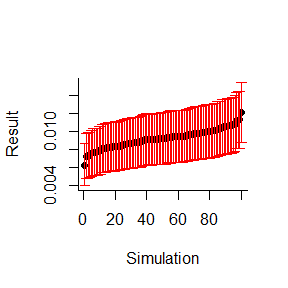

```r
library(digitalPCRsimulations)
```


```r
set.seed(1)
```


```r
# Create universes
universe_target = universe(0.25)
universe_ref = universe(30/22*20)
```


```r
# Take one sample
n_droplets = 20000
conc_target = sample_from_universe(universe_target, n_droplets)
conc_ref = sample_from_universe(universe_ref, n_droplets)
```


```r
# Calculate ratio and its CI
ratio = calc_ratio(conc_target, conc_ref)
```


```r
# Perform 100 simulations
test = simulate_ratios(universe_target,
               universe_ref,
               n_droplets = 20000,
               n_simulations = 100,
               alpha = 0.99)

# Plot results
#png("test.png", res=600, width=5000, height=3000)
plot_simulations(test, real_value=1, error=T, sort=T)
```

<!-- -->

```r
#dev.off()
```
